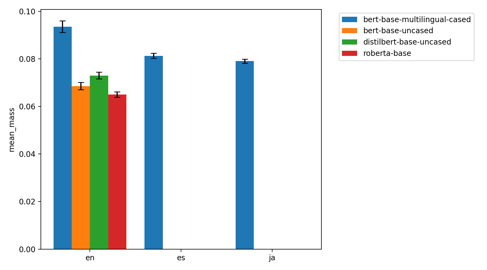
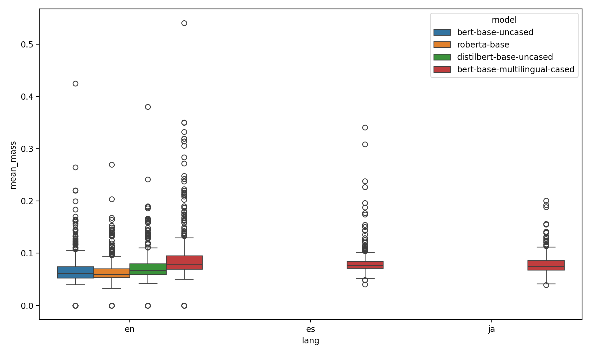

# Syntax Attention Probing Using Universal Dependencies

This project explores how much **transformer models capture syntax** by comparing their attention distributions with **Universal Dependencies (UD) treebanks**.

I evaluate both **monolingual** and **multilingual** models:
  - **Monolingual models**: BERT, RoBERTa, DistilBERT
  - **Multilingual model**: mBERT (across English, Spanish, Japanese)

## Key Idea

If attention heads align strongly with **syntactic dependencies** (e.g., focusing on the syntactic head of a word), then the model shows **syntax awareness**.

I measure this with:
  - **Mean mass** → fraction of attention weight assigned to the correct syntactic head.
  - **Precision@k** → whether the head appears in the top-k attended tokens.

## Results

